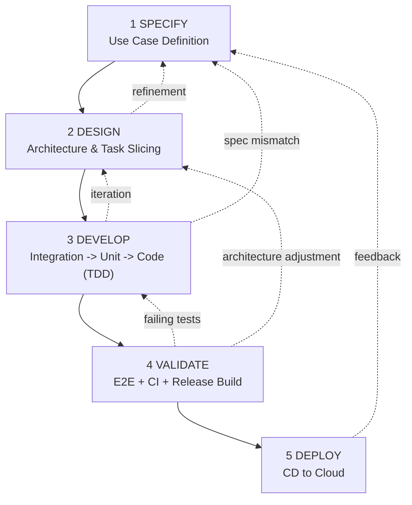

# FHNW BSc BAI -- AI-assisted Software Development

Welcome to the official GitHub organization of the module **AI-assisted Software Development** in the **BSc Business Artificial Intelligence (BAI)** program at FHNW.

This organization provides reference implementations (e.g., BAIssue), capstone repositories, Clean Architecture examples, CI/CD templates, and workflow standards.

---

# AI-Assisted Lean SDLC (AI-SDLC)

A lightweight, disciplined SDLC for **agentic coding** (e.g., Cline, Claude Code, Codex, GitHub Copilot, Cursor, Windsurf) that integrates:

- **Test-Driven Development (TDD)** + **Testing Pyramid**
- **Clean Architecture**
- **CI/CD** + **containerized releases**
- **Lean Spec-Driven Development (SDD)** via `AGENTS.md` + `docs/`
- **SAFe-compatible** iterative delivery
- **Kanban-based execution** (GitHub Projects)

Primary workflow artifacts (repo-local):
- `AGENTS.md` (router + guardrails)
- `docs/TASKS.md` (single source of truth: phase + current UC)
- `docs/PROJECT.md` (architecture + run/test commands)
- `docs/specs/UC-XXX.md` (executable use case specs)
- `docs/ai-sdlc/PHASE-*.md` (phase instructions)

---

## Visual Overview



---

## Phase Summary

### 1. SPECIFY
Turn a user story into a **single executable use case spec** (`docs/specs/UC-XXX.md`): scope (IN/OUT), acceptance criteria, minimal NFRs, and test intent mapping (unit/integration/e2e).  
No coding.

### 2. DESIGN
Stabilize architecture and boundaries using **Clean Architecture** (defined in `docs/PROJECT.md`). Confirm frameworks/libraries, define ports/adapters, and slice **vertical tasks** in `docs/TASKS.md` (integration → unit → implementation).

### 3. DEVELOP
Strict test-first development per task:
1) integration tests (boundary behaviour)  
2) unit tests (domain + use case)  
3) code (Red → Green → Refactor)  
4) review after each step; run unit tests locally

### 4. VALIDATE
Make the UC release-ready:
- e2e tests
- Dockerfile (deployable artifact)
- GitHub Actions: CI (unit+integration) and Release (build image + run e2e on container + publish package)
- quality gates (recommended coverage ≥ 80%)

### 5. DEPLOY
Add CD workflow (e.g., Render) to deploy **validated container artifacts**, including a post-deploy smoke check and documented secret names.

---

## Lean SDD (Spec-Driven Development)

Lean SDD is **controlled by `AGENTS.md`** and the `docs/` files:
- `docs/specs/UC-XXX.md` defines *what* to build (executable intent)
- `docs/TASKS.md` defines *what is next* (phase + task progress)
- `docs/PROJECT.md` defines *how the repo is structured and run*

Minimal example (BAIssue):
```text
https://github.com/AIaSDev/BAIssue/
```

---

## TDD and the Testing Pyramid

Guideline:
- Unit ≈ 70% (domain + application)
- Integration ≈ 20% (interfaces ↔ infrastructure)
- E2E ≈ 10% (full flows against built artifact)

CI expectation:
- unit+integration on PRs
- e2e in release pipeline (container-based)

---

## SAFe and Kanban Alignment

| SAFe concept | AI-SDLC phase |
|---|---|
| Epic / Feature (backlog) | Specify |
| System Architecture | Design |
| Iteration execution | Develop |
| System demo / validation | Validate |
| Release + operate feedback | Deploy → feedback to Specify |

Kanban (GitHub Projects) typically tracks: Spec/Backlog → In progress → Review/CI → Done/Deployed.

---

## Clean Architecture Mapping

| Layer | Primary validation |
|---|---|
| Domain | Unit tests |
| Application | Unit tests |
| Interfaces | Integration tests |
| Infrastructure | Integration + containerized E2E |

---

© FHNW -- BSc Business Artificial Intelligence
