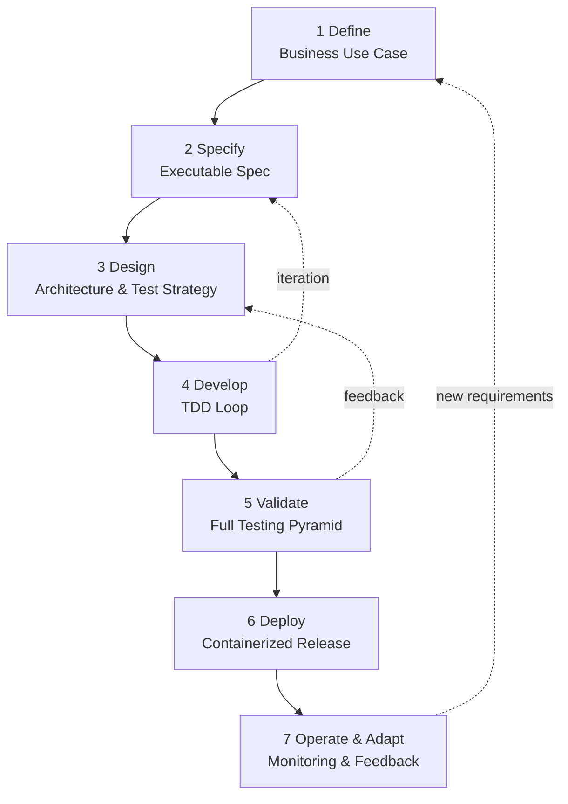

# FHNW BSc BAI -- AI-assisted Software Development

Welcome to the official GitHub organization of the module  
**AI-assisted Software Development**  
in the **BSc Business Artificial Intelligence (BAI)** program at FHNW.

------------------------------------------------------------------------

# AI-Assisted Lean Software Development Life Cycle (AI-SDLC)

This module applies a structured, AI-compatible SDLC integrating:

- Test-Driven Development (TDD) and the Testing Pyramid
- Clean Architecture
- CI/CD and Containerization
- Spec-Driven Development (SDD)
- SAFe-compatible iterative delivery
- Kanban-based execution
- Agentic Coding workflows

The model is disciplined, lightweight, and enterprise-oriented.

------------------------------------------------------------------------

# Visual Overview



------------------------------------------------------------------------

# Core Engineering Order

1. Define business value.
2. Specify executable requirements.
3. Design architecture and testing strategy.
4. Write tests first (TDD).
5. Implement minimal business logic.
6. Validate via full pyramid.
7. Deploy and monitor.

TDD precedes implementation.  
Specification precedes architectural change.  
Architecture precedes use-case coding.

------------------------------------------------------------------------

# Test-Driven Development (TDD)

TDD is mandatory and drives implementation.

## Red → Green → Refactor

1. Write failing unit test.
2. Implement minimal code.
3. Refactor safely.
4. Repeat.

## Testing Pyramid

- Unit ≈ 70%
- Integration ≈ 20%
- E2E ≈ 10%

## CI Enforcement

- Unit tests on commit
- Integration tests on PR
- Full pyramid before deployment

------------------------------------------------------------------------

# Lean Spec-Driven Development (SDD)

Lean SDD structures AI-assisted development using **three Markdown
files**.

## Core Artifacts

-   `AGENTS.md` -- Workflow engine (phase control + rules)
-   `SPECS.md` -- Living specification (goals + architecture intent)
-   `TASKS.md` -- Execution tracking (TDD progress + coverage)

These files are version-controlled, tool-agnostic, and natively usable
by agentic tools.

------------------------------------------------------------------------

## Example -- BAIssue

### AGENTS.md

``` markdown
# AGENTS.md - Lean SDD Workflow

This file defines the development workflow and guardrails.
Do not store project status here. Status lives in TASKS.md.

## Artifacts (must exist at repo root)
- SPECS.md  : Living specification (what/why + architecture intent)
- TASKS.md  : Task list + current phase + progress tracking

## Expected structure

### SPECS.md sections (required)
- Goals
- Scope (in/out)
- Non-Functional Requirements (NFRs) - minimal
- Architecture (Clean Architecture mapping)
- API Contract (OpenAPI link or endpoint list)
- Data Model (entities overview)

### TASKS.md sections (required)
- CURRENT PHASE (single source of truth for phase)
- Task list with per-task test breakdown:
  - Unit
  - Integration
  - E2E
- Definition of Done checklist (per task or global)
- Coverage / quality targets (optional but recommended)

## Phases
1 SPECIFY  : Update SPECS.md (goals/scope/NFRs/contracts). Then set TASKS.md CURRENT PHASE = 2.
2 DESIGN   : Validate architecture + slice tasks in TASKS.md. Then set CURRENT PHASE = 3.
3 DEVELOP  : Implement strictly test-first per task (TDD). Keep Clean Architecture boundaries. Then set CURRENT PHASE = 4.
                ↺ If spec or architecture mismatch → return to 1 or 2
4 VALIDATE : Run full test suite locally and in CI. Fix failures. Then set CURRENT PHASE = 5.
                ↺ If failing → return to 3
5 DEPLOY   : Container build + E2E against container artifact, then release/deploy.
                ↺ If deployment issues → return to 3 or 4

## Rules (guardrails)
- TDD FIRST: write tests before implementation (tests/unit/ → src/)
- Testing Pyramid guideline: Unit ~70%, Integration ~20%, E2E ~10%
- Clean Architecture layering: domain / application / interfaces / infrastructure
- No merge without green CI
- Prefer small vertical slices (one use case end-to-end) over horizontal layers

## Agent Interaction Model

Agents may:
- Propose architectural changes (Phase 2)
- Generate tests (Phase 3 - Red)
- Generate implementation (Phase 3 - Green)
- Suggest refactoring

Agents must NOT:
- Skip TDD
- Merge without green CI
```

------------------------------------------------------------------------

### SPECS.md

``` markdown
# SPECS.md - BAIssue Minimal Spec

## Goals
- Create issues and close issues via REST API.

## Scope
IN:
- Create Issue, Close Issue
OUT:
- Auth, labels, comments

## NFRs
- Response time: typical requests < 100ms locally
- API documented via OpenAPI (/docs)

## Architecture (Clean Architecture)
- Domain: Issue entity (status rules)
- Application: IssueUseCases (create, close)
- Interfaces: FastAPI routes (REST)
- Infrastructure: SQLAlchemy repository + relational DB (SQLite dev/CI, PostgreSQL prod)

## API Contract
- POST /issues
- PATCH /issues/{id}/close
- GET /health

## Data Model (minimal)
- Issue: id, title, status (open|closed)
```

------------------------------------------------------------------------

### TASKS.md

``` markdown
# TASKS.md - BAIssue Tasks

CURRENT PHASE: 3  # 1=Specify | 2=Design | 3=Develop | 4=Validate | 5=Deploy

## Definition of Done (global)
- [ ] Unit tests green
- [ ] Integration tests green
- [ ] E2E tests green (if task has E2E)
- [ ] CI green
- [ ] Code follows Clean Architecture boundaries

## Tasks

### 1. Create Issue
1.1 Unit: domain Issue creation rules [DONE]
1.2 Unit: application IssueUseCases.create() [IN PROGRESS]
1.3 Integration: POST /issues persists + returns 201 [TODO]
1.4 E2E: POST /issues works against container [TODO]

### 2. Close Issue
2.1 Unit: domain Issue.close() transitions open→closed [TODO]
2.2 Unit: application IssueUseCases.close() [TODO]
2.3 Integration: PATCH /issues/{id}/close [TODO]
2.4 E2E: close flow against container [TODO]
```

------------------------------------------------------------------------

# SAFe & Kanban Alignment

| SAFe Concept        | AI-SDLC Phase |
|---------------------|--------------|
| Epic                | Define |
| PI Planning         | Specify |
| System Architecture | Design |
| Sprint Execution    | Develop |
| System Demo         | Validate |
| Inspect & Adapt     | Operate & Adapt |

Kanban boards track:

- Backlog (Spec)
- In Progress (TDD)
- Review (CI)
- Done (Deployed)

------------------------------------------------------------------------

# Clean Architecture Mapping

| Layer           | Validation Level |
|----------------|-----------------|
| Domain         | Unit tests |
| Application    | Unit tests |
| Interfaces     | Integration tests |
| Infrastructure | Containerized E2E tests |

------------------------------------------------------------------------

© FHNW -- BSc Business Artificial Intelligence
