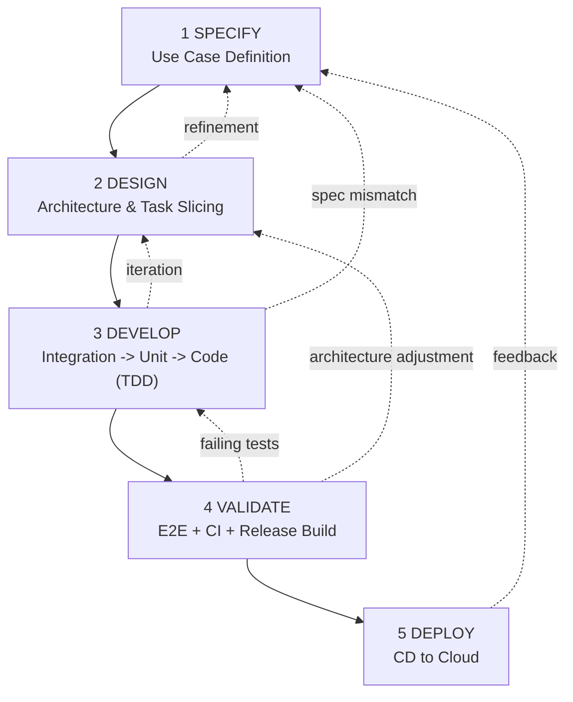

# FHNW BSc BAI -- AI-assisted Software Development

Welcome to the official GitHub organization of the module  
**AI-assisted Software Development**  
in the **BSc Business Artificial Intelligence (BAI)** program at FHNW.

---

# AI-Assisted Lean Software Development Life Cycle (AI-SDLC)

This module applies a structured, AI-compatible SDLC integrating:

- Test-Driven Development (TDD) and the Testing Pyramid
- Clean Architecture
- CI/CD and Containerization
- Lean Spec-Driven Development (SDD) via AGENTS.md
- SAFe-compatible iterative delivery
- Kanban-based execution
- Agentic Coding workflows

The model is lightweight, disciplined, and enterprise-oriented.

---

# Visual Overview

---

# Phase Summary

## 1. SPECIFY
Define a concrete use case from user stories.  
Create a structured specification (`docs/specs/UC-XXX.md`) including scope, acceptance criteria, and minimal NFRs.

No coding.

## 2. DESIGN
Validate Clean Architecture and select frameworks.  
Slice vertical tasks in `docs/TASKS.md`.  

Architecture rule:

domain ← application ← interfaces ← infrastructure

## 3. DEVELOP
Strict TDD execution per use case:

1. Write integration tests  
2. Write unit tests  
3. Implement code (Red → Green → Refactor)  
4. Review after each step  

Unit tests must pass locally before proceeding.

## 4. VALIDATE
- Develop E2E tests  
- Generate Dockerfile  
- Create CI workflow (unit + integration)  
- Create Release workflow (build image + run E2E on container)  
- Ensure CI green  

Testing Pyramid guideline:

- Unit ≈ 70%
- Integration ≈ 20%
- E2E ≈ 10%

## 5. DEPLOY
Create CD workflow (e.g., GitHub Actions → Render).  
Deploy only validated container artifacts.

---

# Lean Spec-Driven Development (SDD)

SDD is controlled via:

- AGENTS.md – workflow router and guardrails  
- docs/TASKS.md – phase + execution tracking  
- docs/specs/UC-XXX.md – executable use case specification  

Example implementation: https://github.com/AIaSDev/BAIssue/

---

# SAFe & Kanban Alignment

| SAFe Concept        | AI-SDLC Phase |
|---------------------|--------------|
| Epic / Feature      | Specify |
| System Architecture | Design |
| Sprint Execution    | Develop |
| System Demo         | Validate |
| Inspect & Adapt     | Deploy → Feedback |

Kanban tracks:

- Backlog (UC specs)
- In Progress (TDD)
- Review (CI)
- Done (Deployed)

---

# Clean Architecture Mapping

| Layer           | Validation |
|----------------|-----------|
| Domain         | Unit tests |
| Application    | Unit tests |
| Interfaces     | Integration tests |
| Infrastructure | Containerized E2E tests |

---

© FHNW -- BSc Business Artificial Intelligence
